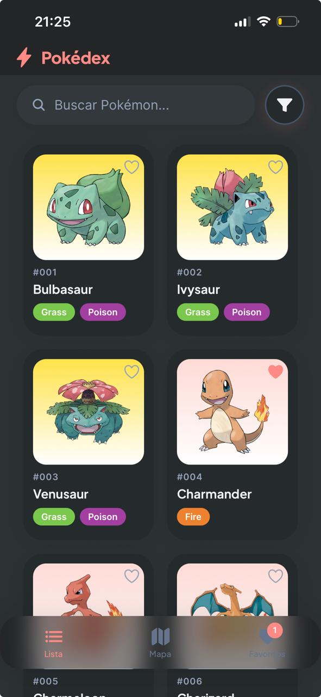
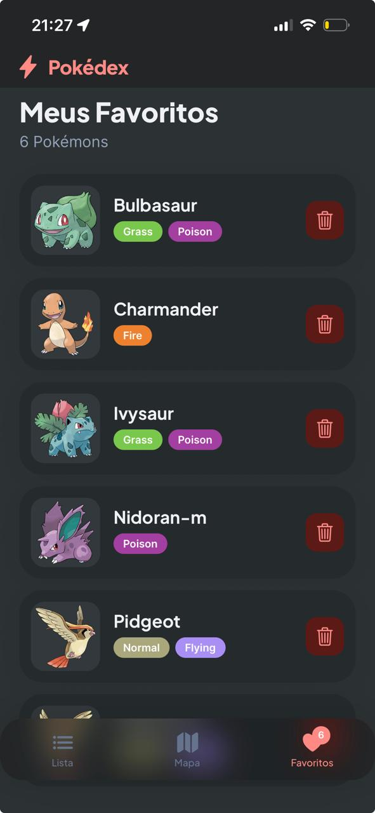
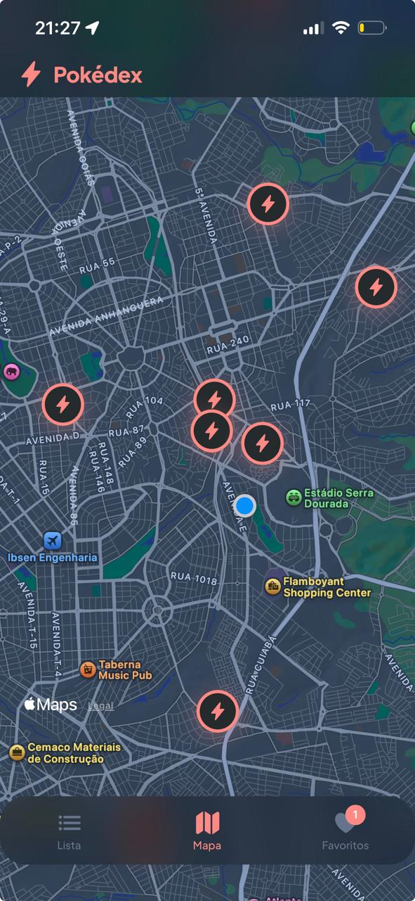

# Pokemon Explorer App

Aplicativo mobile em React Native com Expo para explorar Pokemons usando a [PokeAPI](https://pokeapi.co/), com navegação por abas, mapa com geolocalização e persistência de favoritos.

## Descrição do projeto

O app foi construído para oferecer uma experiência simples e rápida de exploração:

- **Lista**: paginação, busca local e filtro por tipo
- **Mapa**: localização do usuário e pins de Pokemons selvagens no entorno
- **Favoritos**: persistência local com sincronização ao focar a aba

Além disso, a interface inclui:

- tabs com ícones e badge de favoritos
- tema com suporte a modo claro/escuro
- tratamento de imagem com placeholder e fallback

## Capturas de tela

Referência visual (export Stitch): tema escuro, navegação por abas e fluxos principais.

### Lista (`listagem.jpeg`)



### Favoritos (`favoritos.jpeg`)



### Mapa (`mapa.jpeg`)



## Tech Stack

- **Expo + React Native + TypeScript**
  - acelera desenvolvimento mobile com base estável e tipagem forte
- **Expo Router**
  - navegação file-based, simples de manter e escalável
- **Zustand**
  - estado global enxuto, sem boilerplate
- **AsyncStorage**
  - persistência local leve para favoritos
- **react-native-maps**
  - renderização de mapa nativa (iOS/Android)
- **expo-location**
  - fluxo de permissão e obtenção de localização do dispositivo
- **PokeAPI**
  - fonte oficial dos dados de Pokemons

## Instalação

1. Clone o repositório

```bash
git clone <url-do-repositorio>
cd pokemon-explorer-app
```

2. Instale dependências

```bash
npm install
```

3. Inicie o app

```bash
npx expo start
```

## Como rodar no iOS e Android

Com o servidor Expo aberto:

- **Android (emulador/dispositivo)**: pressione `a` no terminal, ou use Expo Go
- **iOS (simulador/macOS)**: pressione `i` no terminal
- **QR Code**: abra no Expo Go (Android/iOS)

Também é possível executar:

```bash
npm run android
npm run ios
```

## Decisões Técnicas

- **Expo Router para navegação file-based**
  - reduz configuração manual e organiza telas por estrutura de pastas
- **Zustand para estado global simples sem boilerplate**
  - facilita leitura/manutenção do store de favoritos
- **AsyncStorage para persistência leve**
  - suficiente para cache local dos favoritos sem backend
- **react-native-maps para mapa nativo**
  - melhor integração e performance para caso de uso geográfico
- **expo-location para geolocalização**
  - API consistente para pedir permissão e obter posição atual
- **Paginação via offset/limit na PokeAPI**
  - evita carregamento excessivo e melhora responsividade da lista

## Estrutura principal

```txt
app/
  (tabs)/
    _layout.tsx
    index.tsx
    mapa.tsx
    favoritos.tsx
src/
  components/
  constants/
  hooks/
  services/
  store/
  types/
```
